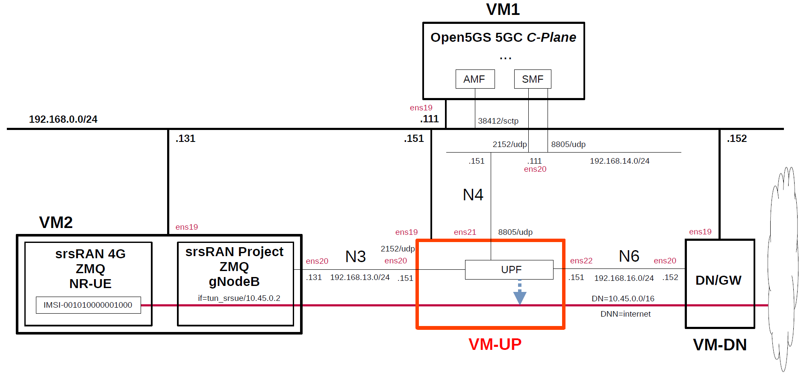

# Simple Measurement of UPF Performance 5
This describes simple performance measurements of several open source UPFs by using [srsRAN_Project](https://github.com/srsran/srsRAN_Project) and [srsRAN_4G](https://github.com/srsran/srsRAN_4G) as the performance measurement tool.
This was measured on the VMs on Proxmox VE.
For other measurement results, please see [Performance Measurement](https://github.com/s5uishida/sample_config_misc_for_mobile_network#performance_measurement).

**Note. Performance measurement results are highly dependent on the measurement conditions. These results are only examples of results under certain measurement conditions.
And this is a very simple measurement, and according to [this comment](https://github.com/open5gs/open5gs/discussions/1780#discussioncomment-10853290), it doesn't seem to make much sense to measure between VMs. I hope it will serve as a reference for a simple configuration when measuring on real devices.**

---

### [Sample Configurations and Miscellaneous for Mobile Network](https://github.com/s5uishida/sample_config_misc_for_mobile_network)

---

<a id="toc"></a>

## Table of Contents

- [Simple Overview of UPF Performance Measurements](#overview)
- [Changes in configuration files of Open5GS, free5GC, UPFs, srsRAN_Project (gNodeB) and srsRAN_4G (NR-UE)](#changes)
  - [Changes in configuration files of Open5GS 5GC C-Plane](#changes_cp_open5gs)
  - [Changes in configuration files of free5GC 5GC C-Plane](#changes_cp_free5gc)
  - [Changes in configuration files of UPFs](#changes_up)
    - [a-1. Changes in configuration files of Open5GS 5GC UPF (TUN)](#changes_up_a1)
    - [a-2. Changes in configuration files of Open5GS 5GC UPF (TAP)](#changes_up_a2)
    - [b. Changes in configuration files of UPG-VPP](#changes_up_b)
    - [c. Changes in configuration files of eUPF](#changes_up_c)
    - [d. Changes in configuration files of free5GC 5GC UPF](#changes_up_d)
  - [Changes in configuration files of srsRAN_Project (gNodeB)](#changes_gnb)
  - [Changes in configuration files of srsRAN_4G (NR-UE)](#changes_ue)
- [Network settings of UPFs and Data Network Gateway](#network_settings)
  - [a-1. Network settings of Open5GS 5GC UPF (TUN)](#network_settings_up_a1)
  - [a-2. Network settings of Open5GS 5GC UPF (TAP)](#network_settings_up_a2)
  - [b. Network settings of UPG-VPP](#network_settings_up_b)
  - [c. Network settings of eUPF](#network_settings_up_c)
  - [d. Network settings of free5GC 5GC UPF](#network_settings_up_d)
  - [Network settings of Data Network Gateway](#network_settings_dn)
- [Build Open5GS, free5GC, UPFs, srsRAN_Project (gNodeB) and srsRAN_4G (NR-UE)](#build)
- [Run Open5GS, free5GC and UPFs](#run)
  - [Run UPFs](#run_up)
    - [a-1. Run Open5GS 5GC UPF (TUN)](#run_up_a1)
    - [a-2. Run Open5GS 5GC UPF (TAP)](#run_up_a2)
    - [b. Run UPG-VPP](#run_up_b)
    - [c. Run eUPF](#run_up_c)
    - [d. Run free5GC 5GC UPF](#run_up_d)
  - [Run 5GC C-Plane](#run_cp)
    - [Run Open5GS 5GC C-Plane](#run_cp_open5gs)
    - [Run free5GC 5GC C-Plane](#run_cp_free5gc)
- [Measure using srsRAN_Project (gNodeB) and srsRAN_4G (NR-UE)](#measure)
  - [Run srsRAN_Project (gNodeB) and srsRAN_4G (NR-UE) on VM2](#run_srsran)
  - [Run iPerf3 server on Data Network Gateway (VM-DN)](#run_iperf3_server)
  - [Try iPerf3 client on VM2](#try_ping_iperf3)
- [Results](#results)
  - [Connected to Open5GS C-Plane](#connect_open5gs)
  - [Connected to free5GC C-Plane](#connect_free5gc)
  - [Summary](#summary)
  - [Performance of N6 interface only](#n6_performance)
- [Changelog (summary)](#changelog)

---

<a id="overview"></a>

## Simple Overview of UPF Performance Measurements

Using Open5GS for 5GC, I will easily measure the performance of several open source UPFs with srsRAN_Project and srsRAN_4G.
**Note that this configuration is implemented with Proxmox VE VMs.**

The following minimum configuration was set as a condition.
- Only one each for C-Plane, U-Plane(UPF) and RAN&UE.

The built simulation environment is as follows.

</img>

The 5GC / RAN&UE used are as follows.

- 5GC - Open5GS v2.7.2 (2024.10.18) - https://github.com/open5gs/open5gs  
  *for Open5GS UPF, UPG-VPP and eUPF*
- 5GC - free5GC v3.4.3 (2024.10.22) - https://github.com/free5gc/free5gc  
  *for free5GC UPF (go-upf)*
- RAN - srsRAN_Project (2024.10.14) - https://github.com/srsran/srsRAN_Project
- UE - srsRAN_4G (2024.02.01) - https://github.com/srsran/srsRAN_4G

The UPFs used are as follows.

- Open5GS v2.7.2 (2024.10.18) - https://github.com/open5gs/open5gs
- UPG-VPP v1.13.0 (2024.03.25) - https://github.com/travelping/upg-vpp
- eUPF v0.6.4 (2024.05.01) - https://github.com/edgecomllc/eupf
- free5GC UPF (go-upf) v1.2.3 (2024.10.11) - https://github.com/free5gc/go-upf  
  gtp5g v0.8.10 (2024.06.03) - https://github.com/free5gc/gtp5g

Each VMs are as follows.
| VM | SW & Role | IP address | OS | CPU | Mem | HDD |
| --- | --- | --- | --- | --- | --- | --- |
| VM1 | Open5GS 5GC C-Plane | 192.168.0.111/24 | Ubuntu 24.04 | 1 | 2GB | 20GB |
| **VM-UP** | **each UPF U-Plane**  | **192.168.0.151/24** | **Ubuntu 24.04<br>or 22.04** | **2** | **8GB** | **20GB** |
| VM-DN | Data Network Gateway  | 192.168.0.152/24 | Ubuntu 24.04 | 2 | 2GB | 10GB |
| VM2 | srsRAN_Project (gNodeB) &<br>srsRAN_4G (NR-UE) | 192.168.0.131/24 | Ubuntu 22.04 | 3 | 6GB | 20GB |

**Each VM-UP(UPFs) are as follows.**
| # | SW | Date | Commit | OS |
| --- | --- | --- | --- | --- |
| a | Open5GS UPF v2.7.2 | 2024.10.18 | `0e441cf710bae0f11014c8e6945cfdf4567f3100` | Ubuntu 24.04 |
| b | UPG-VPP v1.13.0 | 2024.03.25 | `dfdf64000566d35955d7c180720ff66086bd3572` | Ubuntu 22.04 |
| c | eUPF v0.6.4 | 2024.05.01 | `0f704deaca67766733a447f4680cf4d77e638934` | Ubuntu 24.04 |
| d | free5GC UPF<br>(go-upf) v1.2.3 | 2024.10.11 | `6b73d126b8b29b4d17ff744c31ef50634ee64164` | Ubuntu 24.04 |

The network interfaces of each VM except VM-UP are as follows.
| VM | Device | Model | Linux Bridge | IP address | Interface |
| --- | --- | --- | --- | --- | --- |
| VM1 | ens18 | VirtIO | vmbr1 | 10.0.0.111/24 | (NAPT NW) |
| | ens19 | VirtIO | mgbr0 | 192.168.0.111/24 | (Mgmt NW) |
| | ens20 | VirtIO | vmbr4 | 192.168.14.111/24 | N4 |
| VM-DN | ens18 | VirtIO | vmbr1 | 10.0.0.152/24 | (NAPT NW) |
| | ens19 | VirtIO | mgbr0 | 192.168.0.152/24 | (Mgmt NW) |
| | ens20 | VirtIO | vmbr6 | 192.168.16.152/24 | N6 ***(default GW for VM-UP)*** |
| VM2 | ens18 | VirtIO | vmbr1 | 10.0.0.131/24 | (NAPT NW) |
| | ens19 | VirtIO | mgbr0 | 192.168.0.131/24 | (Mgmt NW) |
| | ens20 | VirtIO | vmbr3 | 192.168.13.131/24 | N3 |

**The network interfaces of each VM-UP(UPFs) are as follows.**
**Note that UPFs from `a` to `c` connect to Open5GS CN, but `d` free5GC UPF does not support FTUP flag in PFCP Association Setup Request/Respose, so it connects to free5GC CN.**
| # | SW | Device | Model | Linux Bridge | IP address | Interface |
| --- | --- | --- | --- | --- | --- | --- |
| a | Open5GS UPF | ~~ens18~~ | ~~VirtIO~~ | ~~vmbr1~~ | ~~10.0.0.151/24~~ | ~~(NAPT NW)~~ ***down*** |
| | | ens19 | VirtIO | mgbr0 | 192.168.0.151/24 | (Mgmt NW) |
| | | ens20 | VirtIO | vmbr3 | 192.168.13.151/24 | N3 |
| | | ens21 | VirtIO | vmbr4 | 192.168.14.151/24 | N4 |
| | | ens22 | VirtIO | vmbr6 | 192.168.16.151/24 | N6 |
| b | UPG-VPP | ens18 | VirtIO | vmbr1 | 10.0.0.151/24 | (NAPT NW) |
| | | ens19 | VirtIO | mgbr0 | 192.168.0.151/24 | (Mgmt NW) |
| | | ens20 | VirtIO | vmbr3 | 192.168.13.151/24 | N3 ***(Under DPDK by vfio-pci)*** |
| | | ens21 | VirtIO | vmbr4 | 192.168.14.151/24 | N4 ***(Under DPDK by vfio-pci)*** |
| | | ens22 | VirtIO | vmbr6 | 192.168.16.151/24 | N6 ***(Under DPDK by vfio-pci)*** |
| c | eUPF | ~~ens18~~ | ~~VirtIO~~ | ~~vmbr1~~ | ~~10.0.0.151/24~~ | ~~(NAPT NW)~~ ***down*** |
| | | ens19 | VirtIO | mgbr0 | 192.168.0.151/24 | (Mgmt NW) |
| | | ens20 | VirtIO | vmbr3 | 192.168.13.151/24 | N3 ***(XDP)*** |
| | | ens21 | VirtIO | vmbr4 | 192.168.14.151/24 | N4 |
| | | ens22 | VirtIO | vmbr6 | 192.168.16.151/24 | N6 ***(XDP)*** |
| d | free5GC UPF<br>(go-upf) | ~~ens18~~ | ~~VirtIO~~ | ~~vmbr1~~ | ~~10.0.0.151/24~~ | ~~(NAPT NW)~~ ***down*** |
| | | ens19 | VirtIO | mgbr0 | 192.168.0.151/24 | (Mgmt NW) |
| | | ens20 | VirtIO | vmbr3 | 192.168.13.151/24 | N3 |
| | | ens21 | VirtIO | vmbr4 | 192.168.14.151/24 | N4 |
| | | ens22 | VirtIO | vmbr6 | 192.168.16.151/24 | N6 |

Linux Bridges of Proxmox VE are as follows.
| Linux Bridge | Network CIDR | Interface |
| --- | --- | --- |
| vmbr1 | 10.0.0.0/24 | NAPT NW |
| mgbr0 | 192.168.0.0/24 | Mgmt NW |
| vmbr3 | 192.168.13.0/24 | N3 |
| vmbr4 | 192.168.14.0/24 | N4 |
| vmbr6 | 192.168.16.0/24 | N6 |

The main subscriber Information is as follows.
Please register the subscriber information on each WebConsole of Open5GS and free5GC.
| IMSI | DNN | DN | Key & OPc | S-NSSAI |
| --- | --- | --- | --- | --- |
| 001010000001000 | internet | 10.45.0.0/16 | `Key:465B5CE8B199B49FAA5F0A2EE238A6BC`<br>`OPc:E8ED289DEBA952E4283B54E88E6183CA` | SST:1<br>SD:010203|

The main information of gNodeB is as follows.
| MCC | MNC | TAC | gNodeB ID |
| --- | --- | --- | --- |
| 001 | 01 | 1 | 0x19b |

<a id="changes"></a>

## Changes in configuration files of Open5GS, free5GC, UPFs, srsRAN_Project (gNodeB) and srsRAN_4G (NR-UE)

Please refer to the following for building Open5GS, free5GC, UPFs, srsRAN_Project (gNodeB) and srsRAN_4G (NR-UE) respectively.
- Open5GS v2.7.2 (2024.10.18) - https://open5gs.org/open5gs/docs/guide/02-building-open5gs-from-sources/
- free5GC v3.4.3 (2024.10.22) - https://free5gc.org/guide/
- UPG-VPP v1.13.0 (2024.03.25) - https://github.com/s5uishida/install_vpp_upf_dpdk#annex_1
- eUPF v0.6.4 (2024.05.01) - https://github.com/s5uishida/install_eupf
- free5GC UPF (go-upf) v1.2.3 (2024.10.11) - https://free5gc.org/guide/
- srsRAN_Project (2024.10.14) - https://github.com/s5uishida/build_srsran_5g_zmq
- srsRAN_4G (2024.02.01) - https://github.com/s5uishida/build_srsran_4g_zmq_disable_rf_plugins

<a id="changes_cp_open5gs"></a>

### Changes in configuration files of Open5GS 5GC C-Plane

- `open5gs/install/etc/open5gs/amf.yaml`
```diff
--- amf.yaml.orig       2024-05-11 22:43:06.000000000 +0900
+++ amf.yaml    2024-05-31 19:06:09.171978977 +0900
@@ -20,29 +20,32 @@
         - uri: http://127.0.0.200:7777
   ngap:
     server:
-      - address: 127.0.0.5
+      - address: 192.168.0.111
   metrics:
     server:
       - address: 127.0.0.5
         port: 9090
   guami:
     - plmn_id:
-        mcc: 999
-        mnc: 70
+        mcc: 001
+        mnc: 01
       amf_id:
         region: 2
         set: 1
   tai:
     - plmn_id:
-        mcc: 999
-        mnc: 70
+        mcc: 001
+        mnc: 01
       tac: 1
   plmn_support:
     - plmn_id:
-        mcc: 999
-        mnc: 70
+        mcc: 001
+        mnc: 01
       s_nssai:
         - sst: 1
+          sd: 1
+        - sst: 1
+          sd: 010203
   security:
     integrity_order : [ NIA2, NIA1, NIA0 ]
     ciphering_order : [ NEA0, NEA1, NEA2 ]
```
- `open5gs/install/etc/open5gs/nrf.yaml`
```diff
--- nrf.yaml.orig       2024-05-11 22:43:06.000000000 +0900
+++ nrf.yaml    2024-05-12 03:26:28.737595527 +0900
@@ -11,8 +11,8 @@
 nrf:
   serving:  # 5G roaming requires PLMN in NRF
     - plmn_id:
-        mcc: 999
-        mnc: 70
+        mcc: 001
+        mnc: 01
   sbi:
     server:
       - address: 127.0.0.10
```
- `open5gs/install/etc/open5gs/smf.yaml`
```diff
--- smf.yaml.orig       2024-06-01 00:21:43.876916232 +0900
+++ smf.yaml    2024-05-12 03:30:16.250185155 +0900
@@ -20,16 +20,13 @@
         - uri: http://127.0.0.200:7777
   pfcp:
     server:
-      - address: 127.0.0.4
+      - address: 192.168.14.111
     client:
       upf:
-        - address: 127.0.0.7
-  gtpc:
-    server:
-      - address: 127.0.0.4
+        - address: 192.168.14.151
   gtpu:
     server:
-      - address: 127.0.0.4
+      - address: 192.168.14.111
   metrics:
     server:
       - address: 127.0.0.4
@@ -37,20 +34,17 @@
   session:
     - subnet: 10.45.0.0/16
       gateway: 10.45.0.1
-    - subnet: 2001:db8:cafe::/48
-      gateway: 2001:db8:cafe::1
+      dnn: internet
   dns:
     - 8.8.8.8
     - 8.8.4.4
-    - 2001:4860:4860::8888
-    - 2001:4860:4860::8844
   mtu: 1400
 #  p-cscf:
 #    - 127.0.0.1
 #    - ::1
 #  ctf:
 #    enabled: auto   # auto(default)|yes|no
-  freeDiameter: /root/open5gs/install/etc/freeDiameter/smf.conf
+#  freeDiameter: /root/open5gs/install/etc/freeDiameter/smf.conf
 
 ################################################################################
 # SMF Info
```

<a id="changes_cp_free5gc"></a>

### Changes in configuration files of free5GC 5GC C-Plane

- `free5gc/config/amfcfg.yaml`
```diff
--- amfcfg.yaml.orig    2024-10-14 05:09:24.379203731 +0900
+++ amfcfg.yaml 2024-10-14 05:59:21.011914287 +0900
@@ -5,7 +5,7 @@
 configuration:
   amfName: AMF # the name of this AMF
   ngapIpList:  # the IP list of N2 interfaces on this AMF
-    - 127.0.0.18
+    - 192.168.0.111
   ngapPort: 38412 # the SCTP port listened by NGAP
 
   # Service-based Interface (SBI) Configuration
@@ -30,22 +30,22 @@
   servedGuamiList:
     # <GUAMI> = <MCC><MNC><AMF ID>
     - plmnId: # Public Land Mobile Network ID, <PLMN ID> = <MCC><MNC>
-        mcc: 208 # Mobile Country Code (3 digits string, digit: 0~9)
-        mnc: 93 # Mobile Network Code (2 or 3 digits string, digit: 0~9)
+        mcc: 001 # Mobile Country Code (3 digits string, digit: 0~9)
+        mnc: 01 # Mobile Network Code (2 or 3 digits string, digit: 0~9)
       amfId: cafe00 # AMF identifier (3 bytes hex string, range: 000000~FFFFFF)
 
   # the TAI (Tracking Area Identifier) list supported by this AMF
   supportTaiList:
     - plmnId: # Public Land Mobile Network ID, <PLMN ID> = <MCC><MNC>
-        mcc: 208 # Mobile Country Code (3 digits string, digit: 0~9)
-        mnc: 93 # Mobile Network Code (2 or 3 digits string, digit: 0~9)
+        mcc: 001 # Mobile Country Code (3 digits string, digit: 0~9)
+        mnc: 01 # Mobile Network Code (2 or 3 digits string, digit: 0~9)
       tac: 000001 # Tracking Area Code (3 bytes hex string, range: 000000~FFFFFF)
 
   # the PLMNs (Public land mobile network) list supported by this AMF
   plmnSupportList:
     - plmnId: # Public Land Mobile Network ID, <PLMN ID> = <MCC><MNC>
-        mcc: 208 # Mobile Country Code (3 digits string, digit: 0~9)
-        mnc: 93 # Mobile Network Code (2 or 3 digits string, digit: 0~9)
+        mcc: 001 # Mobile Country Code (3 digits string, digit: 0~9)
+        mnc: 01 # Mobile Network Code (2 or 3 digits string, digit: 0~9)
       snssaiList: # the S-NSSAI (Single Network Slice Selection Assistance Information) list supported by this AMF
         - sst: 1 # Slice/Service Type (uinteger, range: 0~255)
           sd: 010203 # Slice Differentiator (3 bytes hex string, range: 000000~FFFFFF)
```
- `free5gc/config/ausfcfg.yaml`
```diff
--- ausfcfg.yaml.orig   2024-09-01 09:47:28.519041774 +0900
+++ ausfcfg.yaml        2024-09-01 09:55:53.372615743 +0900
@@ -16,10 +16,8 @@
   nrfUri: http://127.0.0.10:8000 # a valid URI of NRF
   nrfCertPem: cert/nrf.pem # NRF Certificate
   plmnSupportList: # the PLMNs (Public Land Mobile Network) list supported by this AUSF
-    - mcc: 208 # Mobile Country Code (3 digits string, digit: 0~9)
-      mnc: 93  # Mobile Network Code (2 or 3 digits string, digit: 0~9)
-    - mcc: 123 # Mobile Country Code (3 digits string, digit: 0~9)
-      mnc: 45  # Mobile Network Code (2 or 3 digits string, digit: 0~9)
+    - mcc: 001 # Mobile Country Code (3 digits string, digit: 0~9)
+      mnc: 01  # Mobile Network Code (2 or 3 digits string, digit: 0~9)
   groupId: ausfGroup001 # ID for the group of the AUSF
   eapAkaSupiImsiPrefix: false # including "imsi-" prefix or not when using the SUPI to do EAP-AKA' authentication
 
```
- `free5gc/config/nrfcfg.yaml`
```diff
--- nrfcfg.yaml.orig    2024-09-01 09:47:28.520041774 +0900
+++ nrfcfg.yaml 2024-09-01 09:56:09.974381863 +0900
@@ -18,8 +18,8 @@
       key: cert/root.key
     oauth: true
   DefaultPlmnId:
-    mcc: 208 # Mobile Country Code (3 digits string, digit: 0~9)
-    mnc: 93 # Mobile Network Code (2 or 3 digits string, digit: 0~9)
+    mcc: 001 # Mobile Country Code (3 digits string, digit: 0~9)
+    mnc: 01 # Mobile Network Code (2 or 3 digits string, digit: 0~9)
   serviceNameList: # the SBI services provided by this NRF, refer to TS 29.510
     - nnrf-nfm # Nnrf_NFManagement service
     - nnrf-disc # Nnrf_NFDiscovery service
```
- `free5gc/config/nssfcfg.yaml`
```diff
--- nssfcfg.yaml.orig   2024-09-01 09:47:28.521041774 +0900
+++ nssfcfg.yaml        2024-09-01 09:56:46.775178233 +0900
@@ -18,12 +18,12 @@
   nrfUri: http://127.0.0.10:8000 # a valid URI of NRF
   nrfCertPem: cert/nrf.pem # NRF Certificate
   supportedPlmnList: # the PLMNs (Public land mobile network) list supported by this NSSF
-    - mcc: 208 # Mobile Country Code (3 digits string, digit: 0~9)
-      mnc: 93 # Mobile Network Code (2 or 3 digits string, digit: 0~9)
+    - mcc: 001 # Mobile Country Code (3 digits string, digit: 0~9)
+      mnc: 01 # Mobile Network Code (2 or 3 digits string, digit: 0~9)
   supportedNssaiInPlmnList: # Supported S-NSSAI List for each PLMN
     - plmnId: # Public Land Mobile Network ID, <PLMN ID> = <MCC><MNC>
-        mcc: 208 # Mobile Country Code (3 digits string, digit: 0~9)
-        mnc: 93 # Mobile Network Code (2 or 3 digits string, digit: 0~9)
+        mcc: 001 # Mobile Country Code (3 digits string, digit: 0~9)
+        mnc: 01 # Mobile Network Code (2 or 3 digits string, digit: 0~9)
       supportedSnssaiList: # Supported S-NSSAIs of the PLMN
         - sst: 1 # Slice/Service Type (uinteger, range: 0~255)
           sd: 010203 # Slice Differentiator (3 bytes hex string, range: 000000~FFFFFF)
```
- `free5gc/config/smfcfg.yaml`
```diff
--- smfcfg.yaml.orig    2024-10-14 05:09:24.379203731 +0900
+++ smfcfg.yaml 2024-10-14 06:03:45.294139455 +0900
@@ -42,16 +42,16 @@
 
   # Optional: PLMN IDs configuration.
   plmnList:
-    - mcc: 208 # Mobile Country Code (3 digits string, digit: 0~9)
-      mnc: 93 # Mobile Network Code (2 or 3 digits string, digit: 0~9)
+    - mcc: 001 # Mobile Country Code (3 digits string, digit: 0~9)
+      mnc: 01 # Mobile Network Code (2 or 3 digits string, digit: 0~9)
   locality: area1 # Name of the location where a set of AMF, SMF, PCF and UPFs are located
 
   # PFCP (Packet Forwarding Control Protocol) configuration for N4 interface.
   pfcp:
     # addr config is deprecated in smf config v1.0.3, please use the following config
-    nodeID: 127.0.0.1 # the Node ID of this SMF
-    listenAddr: 127.0.0.1 # the IP/FQDN of N4 interface on this SMF (PFCP)
-    externalAddr: 127.0.0.1 # the IP/FQDN of N4 interface on this SMF (PFCP)
+    nodeID: 192.168.14.111 # the Node ID of this SMF
+    listenAddr: 192.168.14.111 # the IP/FQDN of N4 interface on this SMF (PFCP)
+    externalAddr: 192.168.14.111 # the IP/FQDN of N4 interface on this SMF (PFCP)
     assocFailAlertInterval: 10s
     assocFailRetryInterval: 30s
     heartbeatInterval: 10s
@@ -63,8 +63,8 @@
         type: AN # the type of the node (AN or UPF)
       UPF: # the name of the node
         type: UPF # the type of the node (AN or UPF)
-        nodeID: 127.0.0.8 # the Node ID of this UPF
-        addr: 127.0.0.8 # the IP/FQDN of N4 interface on this UPF (PFCP)
+        nodeID: 192.168.14.151 # the Node ID of this UPF
+        addr: 192.168.14.151 # the IP/FQDN of N4 interface on this UPF (PFCP)
         sNssaiUpfInfos: # S-NSSAI information list for this UPF
           - sNssai: # S-NSSAI (Single Network Slice Selection Assistance Information)
               sst: 1 # Slice/Service Type (uinteger, range: 0~255)
@@ -72,9 +72,9 @@
             dnnUpfInfoList: # DNN information list for this S-NSSAI
               - dnn: internet
                 pools:
-                  - cidr: 10.60.0.0/16
+                  - cidr: 10.45.0.0/16
                 staticPools:
-                  - cidr: 10.60.100.0/24
+                  - cidr: 10.45.100.0/24
           - sNssai: # S-NSSAI (Single Network Slice Selection Assistance Information)
               sst: 1 # Slice/Service Type (uinteger, range: 0~255)
               sd: 112233 # Slice Differentiator (3 bytes hex string, range: 000000~FFFFFF)
@@ -91,7 +91,7 @@
         interfaces: # Interface list for this UPF
           - interfaceType: N3 # the type of the interface (N3 or N9)
             endpoints: # the IP address of this N3/N9 interface on this UPF
-              - 127.0.0.8
+              - 192.168.13.151
             networkInstances: # Data Network Name (DNN)
               - internet
 
@@ -99,7 +99,8 @@
     links:
       - A: gNB1
         B: UPF
-
+  ulcl: false
+  nwInstFqdnEncoding: true
   # retransmission timer for PDU session modification command
   t3591:
     enable: true # true or false
```

<a id="changes_up"></a>

### Changes in configuration files of UPFs

<a id="changes_up_a1"></a>

#### a-1. Changes in configuration files of Open5GS 5GC UPF (TUN)

- `open5gs/install/etc/open5gs/upf.yaml`
```diff
--- upf.yaml.orig       2024-05-02 19:52:00.000000000 +0900
+++ upf.yaml        2024-05-19 12:38:00.000000000 +0900
@@ -11,18 +11,18 @@
 upf:
   pfcp:
     server:
-      - address: 127.0.0.7
+      - address: 192.168.14.151
     client:
 #      smf:     #  UPF PFCP Client try to associate SMF PFCP Server
 #        - address: 127.0.0.4
   gtpu:
     server:
-      - address: 127.0.0.7
+      - address: 192.168.13.151
   session:
     - subnet: 10.45.0.0/16
       gateway: 10.45.0.1
-    - subnet: 2001:db8:cafe::/48
-      gateway: 2001:db8:cafe::1
+      dnn: internet
+      dev: ogstun
   metrics:
     server:
       - address: 127.0.0.7
```

<a id="changes_up_a2"></a>

#### a-2. Changes in configuration files of Open5GS 5GC UPF (TAP)

- `open5gs/install/etc/open5gs/upf.yaml`
```diff
--- upf.yaml.orig       2024-05-02 19:52:00.000000000 +0900
+++ upf.yaml        2024-09-23 14:00:20.724467385 +0900
@@ -11,18 +11,18 @@
 upf:
   pfcp:
     server:
-      - address: 127.0.0.7
+      - address: 192.168.14.151
     client:
 #      smf:     #  UPF PFCP Client try to associate SMF PFCP Server
 #        - address: 127.0.0.4
   gtpu:
     server:
-      - address: 127.0.0.7
+      - address: 192.168.13.151
   session:
     - subnet: 10.45.0.0/16
       gateway: 10.45.0.1
-    - subnet: 2001:db8:cafe::/48
-      gateway: 2001:db8:cafe::1
+      dnn: internet
+      dev: ogstap
   metrics:
     server:
       - address: 127.0.0.7
```

<a id="changes_up_b"></a>

#### b. Changes in configuration files of UPG-VPP

See [here](https://github.com/s5uishida/install_vpp_upf_dpdk#changes_up) for the original files.

- `openair-upf/startup.conf`  
There is no change.

- `openair-upf/init.conf`  
There is no change.

<a id="changes_up_c"></a>

#### c. Changes in configuration files of eUPF

See [here](https://github.com/s5uishida/install_eupf#create-configuration-file) for the original file.

- `eupf/config.yml`  
There is no change.

<a id="changes_up_d"></a>

#### d. Changes in configuration files of free5GC 5GC UPF

- `go-upf/upfcfg.yaml`
```diff
--- upfcfg.yaml.orig    2024-10-14 04:53:12.341028732 +0900
+++ upfcfg.yaml 2024-10-14 06:11:36.636303534 +0900
@@ -4,8 +4,8 @@
 # PFCP Configuration
 # The listen IP and nodeID of the N4 interface on this UPF (Can't set to 0.0.0.0)
 pfcp:
-  addr: 127.0.0.8   # IP addr for listening
-  nodeID: 127.0.0.8 # External IP or FQDN can be reached
+  addr: 192.168.14.151   # IP addr for listening
+  nodeID: 192.168.14.151 # External IP or FQDN can be reached
   retransTimeout: 1s # retransmission timeout
   maxRetrans: 3 # the max number of retransmission
 
@@ -18,7 +18,7 @@
   # If you bind to a specific IP, ensure SMF uses the same IP in its N3 configuration.
   # If you bind to all (0.0.0.0), SMF can use any of the available UPF IPs, but do not use 0.0.0.0 in SMF.
   ifList:
-    - addr: 127.0.0.8
+    - addr: 192.168.13.151
       type: N3
       # name: upf.5gc.nctu.me
       # ifname: gtpif
@@ -28,9 +28,7 @@
 # List of Data Network Names (DNN) supported by this UPF.
 dnnList:
   - dnn: internet # Data Network Name
-    cidr: 10.60.0.0/16 # Classless Inter-Domain Routing for assigned IPv4 pool of UE
-  - dnn: internet # Data Network Name
-    cidr: 10.61.0.0/16 # Classless Inter-Domain Routing for assigned IPv4 pool of UE
+    cidr: 10.45.0.0/16 # Classless Inter-Domain Routing for assigned IPv4 pool of UE
     # natifname: eth0
 
 # Logging Configuration
```

<a id="changes_gnb"></a>

### Changes in configuration files of srsRAN_Project (gNodeB)

See [here](https://github.com/s5uishida/build_srsran_5g_zmq#create-the-configuration-file-of-gnodeb) for the original files.

- `srsRAN_Project/build/apps/gnb/gnb_zmq.yaml`
```diff
--- gnb_zmq.yaml.orig   2024-10-14 18:46:45.000000000 +0900
+++ gnb_zmq.yaml        2024-11-01 20:05:27.752320115 +0900
@@ -3,17 +3,29 @@
 # To run the srsRAN Project gNB with this config, use the following command: 
 #   sudo ./gnb -c gnb_zmq.yaml
 
+gnb_id: 0x19B
+
+cu_up:
+  upf:
+    bind_addr: 192.168.13.131             # Optional TEXT. Sets local IP address to bind for N3 interface. Format: IPV4 or IPV6 IP address.
+    bind_interface: ens20                 # Optional TEXT. Sets network device to bind for N3 interface. Format: IPV4 or IPV6 IP address.
+    ext_addr: auto                        # Optional TEXT. Sets external IP address that is advertised to receive GTP-U packets from UPF via N3 interface. Format: IPV4 or IPV6 IP address.
+    udp_max_rx_msgs: 256                  # Optional INT. Sets the maximum amount of messages RX in a single syscall.
+    pool_threshold: 0.9                   # Optional FLOAT. Sets the pool accupancy threshold after which packets are dropped. Supported: [0.0 - 1.0].
+    no_core: false                        # Optional BOOLEAN. Setting to true allows the gNB to run without a core. Supported: [0, 1].
+
 cu_cp:
   amf:
-    addr: 10.53.1.2                 # The address or hostname of the AMF.
+    addr: 192.168.0.111                 # The address or hostname of the AMF.
     port: 38412
-    bind_addr: 10.53.1.1            # A local IP that the gNB binds to for traffic from the AMF.
+    bind_addr: 192.168.0.131            # A local IP that the gNB binds to for traffic from the AMF.
     supported_tracking_areas:
-      - tac: 7
+      - tac: 1
         plmn_list:
           - plmn: "00101"
             tai_slice_support_list:
               - sst: 1
+                sd: 66051
   inactivity_timer: 7200            # Sets the UE/PDU Session/DRB inactivity timer to 7200 seconds. Supported: [1 - 7200].
 
 ru_sdr:
@@ -29,7 +41,7 @@
   channel_bandwidth_MHz: 20         # Bandwith in MHz. Number of PRBs will be automatically derived.
   common_scs: 15                    # Subcarrier spacing in kHz used for data.
   plmn: "00101"                     # PLMN broadcasted by the gNB.
-  tac: 7                            # Tracking area code (needs to match the core configuration).
+  tac: 1                            # Tracking area code (needs to match the core configuration).
   pdcch:
     common:
       ss0_index: 0                  # Set search space zero index to match srsUE capabilities
```

<a id="changes_ue"></a>

### Changes in configuration files of srsRAN_4G (NR-UE)

See [here](https://github.com/s5uishida/build_srsran_4g_zmq_disable_rf_plugins#create-the-configuration-file-of-nr-ue) for the original files.

- `srsRAN_4G/build/srsue/ue_zmq.conf`
```diff
--- ue_zmq.conf.orig    2023-12-07 03:04:58.000000000 +0900
+++ ue_zmq.conf 2024-10-17 20:34:10.000000000 +0900
@@ -34,9 +34,9 @@
 [usim]
 mode = soft
 algo = milenage
-opc  = 63BFA50EE6523365FF14C1F45F88737D
-k    = 00112233445566778899aabbccddeeff
-imsi = 001010123456780
+opc  = E8ED289DEBA952E4283B54E88E6183CA
+k    = 465B5CE8B199B49FAA5F0A2EE238A6BC
+imsi = 001010000001000
 imei = 353490069873319
 
 [rrc]
@@ -44,11 +44,16 @@
 ue_category = 4
 
 [nas]
-apn = srsapn
+apn = internet
 apn_protocol = ipv4
 
+[slicing]
+enable = true
+nssai-sst = 1
+nssai-sd = 66051
+
 [gw]
-netns = ue1
+#netns = ue1
 ip_devname = tun_srsue
 ip_netmask = 255.255.255.0
 
```

<a id="network_settings"></a>

## Network settings of UPFs and Data Network Gateway

<a id="network_settings_up_a1"></a>

### a-1. Network settings of Open5GS 5GC UPF (TUN)

First, uncomment the next line in the `/etc/sysctl.conf` file and reflect it in the OS.
```
net.ipv4.ip_forward=1
```
```
# sysctl -p
```
Next, down the interface `ens18` of the VM-UP and set the VM-DN IP address to default GW on the N6 interface`ens22`.
```
# ip link set dev ens18 down
# ip route add default via 192.168.16.152 dev ens22
```
Then, configure the TUNnel interface.
```
# ip tuntap add name ogstun mode tun
# ip addr add 10.45.0.1/16 dev ogstun
# ip link set ogstun up
```

<a id="network_settings_up_a2"></a>

### a-2. Network settings of Open5GS 5GC UPF (TAP)

First, uncomment the next line in the `/etc/sysctl.conf` file and reflect it in the OS.
```
net.ipv4.ip_forward=1
```
```
# sysctl -p
```
Next, down the interface `ens18` of the VM-UP and set the VM-DN IP address to default GW on the N6 interface`ens22`.
```
# ip link set dev ens18 down
# ip route add default via 192.168.16.152 dev ens22
```
Then, configure the TAP interface.
```
# ip tuntap add name ogstap mode tap
# ip addr add 10.45.0.1/16 dev ogstap
# ip link set ogstap up
```

<a id="network_settings_up_b"></a>

### b. Network settings of UPG-VPP

See [this](https://github.com/s5uishida/install_vpp_upf_dpdk#setup_up).

<a id="network_settings_up_c"></a>

### c. Network settings of eUPF

First, uncomment the next line in the `/etc/sysctl.conf` file and reflect it in the OS.
```
net.ipv4.ip_forward=1
```
```
# sysctl -p
```
Next, down the interface `ens18` of the VM-UP and set the VM-DN IP address to default GW on the N6 interface`ens22`.
```
# ip link set dev ens18 down
# ip route add default via 192.168.16.152 dev ens22
```

<a id="network_settings_up_d"></a>

### d. Network settings of free5GC 5GC UPF

First, uncomment the next line in the `/etc/sysctl.conf` file and reflect it in the OS.
```
net.ipv4.ip_forward=1
```
```
# sysctl -p
```
Next, down the interface `ens18` of the VM-UP and set the VM-DN IP address to default GW on the N6 interface`ens22`.
```
# ip link set dev ens18 down
# ip route add default via 192.168.16.152 dev ens22
```

<a id="network_settings_dn"></a>

### Network settings of Data Network Gateway

First, uncomment the next line in the `/etc/sysctl.conf` file and reflect it in the OS.
```
net.ipv4.ip_forward=1
```
```
# sysctl -p
```
Next, configure NAPT and routing to N6 IP address of UPF.
```
# iptables -t nat -A POSTROUTING -s 10.45.0.0/16 -j MASQUERADE
# ip route add 10.45.0.0/16 via 192.168.16.151 dev ens20
```

<a id="build"></a>

## Build Open5GS, free5GC, UPFs, srsRAN_Project (gNodeB) and srsRAN_4G (NR-UE)

Please refer to the following for building Open5GS, free5GC, UPFs, srsRAN_Project (gNodeB) and srsRAN_4G (NR-UE) respectively.
- Open5GS v2.7.2 (2024.10.18) - https://open5gs.org/open5gs/docs/guide/02-building-open5gs-from-sources/
- free5GC v3.4.3 (2024.10.22) - https://free5gc.org/guide/
- UPG-VPP v1.13.0 (2024.03.25) - https://github.com/s5uishida/install_vpp_upf_dpdk#annex_1
- eUPF v0.6.4 (2024.05.01) - https://github.com/s5uishida/install_eupf
- free5GC UPF (go-upf) v1.2.3 (2024.10.11) - https://free5gc.org/guide/
- srsRAN_Project (2024.10.14) - https://github.com/s5uishida/build_srsran_5g_zmq
- srsRAN_4G (2024.02.01) - https://github.com/s5uishida/build_srsran_4g_zmq_disable_rf_plugins

Install MongoDB on Open5GS and free5GC C-Plane machines.
[MongoDB Compass](https://www.mongodb.com/products/compass) is a convenient tool to look at the MongoDB database.

<a id="run"></a>

## Run Open5GS, free5GC and UPFs

First run each UPF, then each 5GC.
Each UPF uses the same IP address, so start only the UPF you want to measure.

<a id="run_up"></a>

### Run UPFs

<a id="run_up_a1"></a>

#### a-1. Run Open5GS 5GC UPF (TUN)

Please use the configuration files changed for TUN interface.
```
# cd open5gs
# ./install/bin/open5gs-upfd
```

<a id="run_up_a2"></a>

#### a-2. Run Open5GS 5GC UPF (TAP)

Please use the configuration files changed for TAP interface.
```
# cd open5gs
# ./install/bin/open5gs-upfd
```

<a id="run_up_b"></a>

#### b. Run UPG-VPP

See [this](https://github.com/s5uishida/install_vpp_upf_dpdk#run).

<a id="run_up_c"></a>

#### c. Run eUPF

See [this](https://github.com/s5uishida/install_eupf#run).

<a id="run_up_d"></a>

#### d. Run free5GC 5GC UPF

```
# cd free5gc
# ./bin/upf
```

<a id="run_cp"></a>

### Run 5GC C-Plane

<a id="run_cp_open5gs"></a>

#### Run Open5GS 5GC C-Plane

```
./install/bin/open5gs-nrfd &
sleep 2
./install/bin/open5gs-scpd &
sleep 2
./install/bin/open5gs-amfd &
sleep 2
./install/bin/open5gs-smfd &
./install/bin/open5gs-ausfd &
./install/bin/open5gs-udmd &
./install/bin/open5gs-udrd &
./install/bin/open5gs-pcfd &
./install/bin/open5gs-nssfd &
./install/bin/open5gs-bsfd &
```

<a id="run_cp_free5gc"></a>

#### Run free5GC 5GC C-Plane

Create the following shell script and run it.
```bash
#!/usr/bin/env bash

PID_LIST=()

NF_LIST="nrf amf smf udr pcf udm nssf ausf chf"

export GIN_MODE=release

for NF in ${NF_LIST}; do
    ./bin/${NF} &
    PID_LIST+=($!)
    sleep 1
done

function terminate()
{
    sudo kill -SIGTERM ${PID_LIST[${#PID_LIST[@]}-2]} ${PID_LIST[${#PID_LIST[@]}-1]}
    sleep 2
}

trap terminate SIGINT
wait ${PID_LIST}
```

<a id="measure"></a>

## Measure using srsRAN_Project (gNodeB) and srsRAN_4G (NR-UE)

This time, I will measure only one connection by one UE.
First, run srsRAN_Project (gNodeB) and srsRAN_4G (NR-UE) to establish a connection that will be used to measure performance.
Then, start the iperf3 server on the Data Network Gateway and connect to it from an iperf3 client on VM2 to take measurements.

**Note that ping measurements are not performed because the connection between srsRAN_Project (gNodeB) and srsRAN_4G (NR-UE) is via ZeroMQ, and the RTT value cannot be expected.**

<a id="run_srsran"></a>

### Run srsRAN_Project (gNodeB) and srsRAN_4G (NR-UE) on VM2

First, run ssrsRAN_Project (gNodeB) and connect to Open5GS 5GC.
```
# cd ~/srsRAN_Project/build/apps/gnb
# ./gnb -c gnb_zmq.yaml

--== srsRAN gNB (commit 9d5dd742a) ==--


The PRACH detector will not meet the performance requirements with the configuration {Format 0, ZCZ 0, SCS 1.25kHz, Rx ports 1}.
Lower PHY in executor blocking mode.
Available radio types: zmq.
Cell pci=1, bw=20 MHz, 1T1R, dl_arfcn=368500 (n3), dl_freq=1842.5 MHz, dl_ssb_arfcn=368410, ul_freq=1747.5 MHz

N2: Connection to AMF on 192.168.0.111:38412 completed
==== gNB started ===
Type <h> to view help

```
Then, run srsRAN_4G (NR-UE) and connect to Open5GS 5GC.
```
# cd ~/srsRAN_4G/build/srsue
# ./src/srsue ue_zmq.conf
Reading configuration file ue_zmq.conf...

Built in Release mode using commit ec29b0c1f on branch master.

Opening 1 channels in RF device=zmq with args=tx_port=tcp://127.0.0.1:2001,rx_port=tcp://127.0.0.1:2000,base_srate=23.04e6
Supported RF device list: zmq file
CHx base_srate=23.04e6
Current sample rate is 1.92 MHz with a base rate of 23.04 MHz (x12 decimation)
CH0 rx_port=tcp://127.0.0.1:2000
CH0 tx_port=tcp://127.0.0.1:2001
Current sample rate is 23.04 MHz with a base rate of 23.04 MHz (x1 decimation)
Current sample rate is 23.04 MHz with a base rate of 23.04 MHz (x1 decimation)
Waiting PHY to initialize ... done!
Attaching UE...
Random Access Transmission: prach_occasion=0, preamble_index=0, ra-rnti=0x39, tti=334
Random Access Complete.     c-rnti=0x4601, ta=0
RRC Connected
PDU Session Establishment successful. IP: 10.45.0.2
RRC NR reconfiguration successful.
```

<a id="run_iperf3_server"></a>

### Run iPerf3 server on Data Network Gateway (VM-DN)

```
# iperf3 -s
```

<a id="try_ping_iperf3"></a>

### Try iPerf3 client on VM2

Try iperf3 client to the address(`192.168.16.152`) of N6 interface on Data Network Gateway.

e.g.) The UPF used in the measurement below is UPG-VPP v1.13.0.
```
# iperf3 -B 10.45.0.2 -c 192.168.16.152
Connecting to host 192.168.16.152, port 5201
[  5] local 10.45.0.2 port 58159 connected to 192.168.16.152 port 5201
[ ID] Interval           Transfer     Bitrate         Retr  Cwnd
[  5]   0.00-1.00   sec   300 MBytes  2.52 Gbits/sec    0   8.63 MBytes       
[  5]   1.00-2.00   sec   360 MBytes  3.02 Gbits/sec    0   8.63 MBytes       
[  5]   2.00-3.00   sec   341 MBytes  2.86 Gbits/sec    0   8.63 MBytes       
[  5]   3.00-4.00   sec   319 MBytes  2.67 Gbits/sec    0   8.63 MBytes       
[  5]   4.00-5.00   sec   331 MBytes  2.78 Gbits/sec    0   8.63 MBytes       
[  5]   5.00-6.00   sec   344 MBytes  2.88 Gbits/sec    0   8.63 MBytes       
[  5]   6.00-7.00   sec   346 MBytes  2.90 Gbits/sec    0   8.63 MBytes       
[  5]   7.00-8.00   sec   362 MBytes  3.04 Gbits/sec    0   8.63 MBytes       
[  5]   8.00-9.00   sec   374 MBytes  3.14 Gbits/sec    0   8.63 MBytes       
[  5]   9.00-10.00  sec   350 MBytes  2.94 Gbits/sec    0   8.63 MBytes       
- - - - - - - - - - - - - - - - - - - - - - - - -
[ ID] Interval           Transfer     Bitrate         Retr
[  5]   0.00-10.00  sec  3.35 GBytes  2.88 Gbits/sec    0             sender
[  5]   0.00-10.01  sec  3.35 GBytes  2.87 Gbits/sec                  receiver

iperf Done.
```

<a id="results"></a>

## Results

These measurements are the values measured between the IP address `10.45.0.0/16` assigned by srsRAN_Project (gNodeB) and srsRAN_4G (NR-UE) on VM2 and the IP address `192.168.16.152` of the Data Network Gateway N6 interface on VM-DN.
The measurements were taken in the following pattern:

1. `iperf3 -B 10.45.0.2 -c 192.168.16.152` (for free5GC, `-B 10.45.0.1`)  
2. `iperf3 -B 10.45.0.2 -c 192.168.16.152 -u -b 5G` (for free5GC, `-B 10.45.0.1`)<br>**UDP packet loss** is a value measured under deliberate load (5 Gbps) in order to compare performance limits.  
3. These are the measured values when `xdp_attach_mode` is set to `native`. Note that `generic` mode is implemented at the kernel level, so it does not contribute to performance improvement. If it is set to `offload`(NIC-level implementation), it may be expected to more improved performance than `native` (Driver-level implementation). For reference, a list of drivers that support XDP can be found [here](https://github.com/iovisor/bcc/blob/master/docs/kernel-versions.md#xdp).

<a id="connect_open5gs"></a>

### Connected to Open5GS C-Plane

| # | UPF | Date | 1) TCP<br>throughput | 2) UDP<br>throughput | 2) UDP<br>packet loss |
| --- | --- | --- | --- | --- | --- |
| a-1 | Open5GS UPF v2.7.2 (TUN) | 2024.10.18 | S:2.86 Gbps<br>R:2.86 Gbps | S:1.91 Gbps<br>R:1.88 Gbps | 1.3 % |
| a-2 | Open5GS UPF v2.7.2 (TAP) | 2024.10.18 | S:3.05 Gbps<br>R:3.05 Gbps | S:1.83 Gbps<br>R:1.80 Gbps | 1.5 % |
| b | UPG-VPP v1.13.0 | 2024.03.25 | S:2.88 Gbps<br>R:2.87 Gbps | S:1.11 Gbps<br>R:1.09 Gbps | 1.8 % |
| c | **3) eUPF v0.6.4** | 2024.05.01 | S:2.95 Gbps<br>R:2.94 Gbps | S:1.89 Gbps<br>R:1.80 Gbps | 4.4 % |

<details><summary>a-1. iPerf3 logs for Open5GS UPF v2.7.2 (TUN)</summary>

```
# iperf3 -B 10.45.0.2 -c 192.168.16.152
Connecting to host 192.168.16.152, port 5201
[  5] local 10.45.0.2 port 45327 connected to 192.168.16.152 port 5201
[ ID] Interval           Transfer     Bitrate         Retr  Cwnd
[  5]   0.00-1.00   sec   351 MBytes  2.94 Gbits/sec    0   7.51 MBytes       
[  5]   1.00-2.00   sec   351 MBytes  2.95 Gbits/sec    0   7.51 MBytes       
[  5]   2.00-3.00   sec   350 MBytes  2.94 Gbits/sec    0   7.51 MBytes       
[  5]   3.00-4.00   sec   339 MBytes  2.84 Gbits/sec    0   7.51 MBytes       
[  5]   4.00-5.00   sec   351 MBytes  2.95 Gbits/sec    0   7.51 MBytes       
[  5]   5.00-6.00   sec   322 MBytes  2.70 Gbits/sec    0   7.51 MBytes       
[  5]   6.00-7.00   sec   339 MBytes  2.84 Gbits/sec    0   7.51 MBytes       
[  5]   7.00-8.00   sec   338 MBytes  2.83 Gbits/sec    0   7.51 MBytes       
[  5]   8.00-9.00   sec   338 MBytes  2.83 Gbits/sec    0   7.51 MBytes       
[  5]   9.00-10.00  sec   336 MBytes  2.82 Gbits/sec    0   7.51 MBytes       
- - - - - - - - - - - - - - - - - - - - - - - - -
[ ID] Interval           Transfer     Bitrate         Retr
[  5]   0.00-10.00  sec  3.33 GBytes  2.86 Gbits/sec    0             sender
[  5]   0.00-10.01  sec  3.33 GBytes  2.86 Gbits/sec                  receiver

iperf Done.
```
```
# iperf3 -B 10.45.0.2 -c 192.168.16.152 -u -b 5G
Connecting to host 192.168.16.152, port 5201
[  5] local 10.45.0.2 port 59819 connected to 192.168.16.152 port 5201
[ ID] Interval           Transfer     Bitrate         Total Datagrams
[  5]   0.00-1.00   sec   255 MBytes  2.14 Gbits/sec  184530  
[  5]   1.00-2.00   sec   190 MBytes  1.60 Gbits/sec  137694  
[  5]   2.00-3.00   sec   231 MBytes  1.94 Gbits/sec  167064  
[  5]   3.00-4.00   sec   178 MBytes  1.50 Gbits/sec  129242  
[  5]   4.00-5.00   sec   215 MBytes  1.81 Gbits/sec  156030  
[  5]   5.00-6.00   sec   257 MBytes  2.16 Gbits/sec  186155  
[  5]   6.00-7.00   sec   177 MBytes  1.49 Gbits/sec  128425  
[  5]   7.00-8.00   sec   239 MBytes  2.00 Gbits/sec  172829  
[  5]   8.00-9.00   sec   243 MBytes  2.04 Gbits/sec  176160  
[  5]   9.00-10.00  sec   292 MBytes  2.45 Gbits/sec  211204  
- - - - - - - - - - - - - - - - - - - - - - - - -
[ ID] Interval           Transfer     Bitrate         Jitter    Lost/Total Datagrams
[  5]   0.00-10.00  sec  2.22 GBytes  1.91 Gbits/sec  0.000 ms  0/1649333 (0%)  sender
[  5]   0.00-10.01  sec  2.20 GBytes  1.88 Gbits/sec  0.004 ms  21499/1649333 (1.3%)  receiver

iperf Done.
```

</details>

<details><summary>a-2. iPerf3 logs for Open5GS UPF v2.7.2 (TAP)</summary>

```
# iperf3 -B 10.45.0.2 -c 192.168.16.152
Connecting to host 192.168.16.152, port 5201
[  5] local 10.45.0.2 port 41169 connected to 192.168.16.152 port 5201
[ ID] Interval           Transfer     Bitrate         Retr  Cwnd
[  5]   0.00-1.00   sec   352 MBytes  2.95 Gbits/sec    0   3.86 MBytes       
[  5]   1.00-2.00   sec   386 MBytes  3.24 Gbits/sec    0   3.86 MBytes       
[  5]   2.00-3.00   sec   391 MBytes  3.28 Gbits/sec    0   3.86 MBytes       
[  5]   3.00-4.00   sec   401 MBytes  3.37 Gbits/sec    0   3.86 MBytes       
[  5]   4.00-5.00   sec   371 MBytes  3.11 Gbits/sec    0   3.86 MBytes       
[  5]   5.00-6.00   sec   362 MBytes  3.04 Gbits/sec    0   3.86 MBytes       
[  5]   6.00-7.00   sec   355 MBytes  2.98 Gbits/sec    0   3.86 MBytes       
[  5]   7.00-8.00   sec   338 MBytes  2.83 Gbits/sec    0   3.86 MBytes       
[  5]   8.00-9.00   sec   358 MBytes  3.00 Gbits/sec    0   3.86 MBytes       
[  5]   9.00-10.00  sec   328 MBytes  2.74 Gbits/sec    0   3.86 MBytes       
- - - - - - - - - - - - - - - - - - - - - - - - -
[ ID] Interval           Transfer     Bitrate         Retr
[  5]   0.00-10.00  sec  3.56 GBytes  3.05 Gbits/sec    0             sender
[  5]   0.00-10.02  sec  3.56 GBytes  3.05 Gbits/sec                  receiver

iperf Done.
```
```
# iperf3 -B 10.45.0.2 -c 192.168.16.152 -u -b 5G
Connecting to host 192.168.16.152, port 5201
[  5] local 10.45.0.2 port 36544 connected to 192.168.16.152 port 5201
[ ID] Interval           Transfer     Bitrate         Total Datagrams
[  5]   0.00-1.00   sec   267 MBytes  2.24 Gbits/sec  193219  
[  5]   1.00-2.00   sec   261 MBytes  2.19 Gbits/sec  189263  
[  5]   2.00-3.00   sec   309 MBytes  2.59 Gbits/sec  223526  
[  5]   3.00-4.00   sec   260 MBytes  2.18 Gbits/sec  188062  
[  5]   4.00-5.00   sec   190 MBytes  1.59 Gbits/sec  137503  
[  5]   5.00-6.00   sec   165 MBytes  1.39 Gbits/sec  119698  
[  5]   6.00-7.00   sec   166 MBytes  1.39 Gbits/sec  119851  
[  5]   7.00-8.00   sec   168 MBytes  1.41 Gbits/sec  121927  
[  5]   8.00-9.00   sec   183 MBytes  1.54 Gbits/sec  132873  
[  5]   9.00-10.00  sec   214 MBytes  1.80 Gbits/sec  155103  
- - - - - - - - - - - - - - - - - - - - - - - - -
[ ID] Interval           Transfer     Bitrate         Jitter    Lost/Total Datagrams
[  5]   0.00-10.00  sec  2.13 GBytes  1.83 Gbits/sec  0.000 ms  0/1581025 (0%)  sender
[  5]   0.00-10.01  sec  2.10 GBytes  1.80 Gbits/sec  0.003 ms  23688/1580991 (1.5%)  receiver

iperf Done.
```

</details>

<details><summary>b. iPerf3 logs for UPG-VPP v1.13.0</summary>

```
# iperf3 -B 10.45.0.2 -c 192.168.16.152
Connecting to host 192.168.16.152, port 5201
[  5] local 10.45.0.2 port 58159 connected to 192.168.16.152 port 5201
[ ID] Interval           Transfer     Bitrate         Retr  Cwnd
[  5]   0.00-1.00   sec   300 MBytes  2.52 Gbits/sec    0   8.63 MBytes       
[  5]   1.00-2.00   sec   360 MBytes  3.02 Gbits/sec    0   8.63 MBytes       
[  5]   2.00-3.00   sec   341 MBytes  2.86 Gbits/sec    0   8.63 MBytes       
[  5]   3.00-4.00   sec   319 MBytes  2.67 Gbits/sec    0   8.63 MBytes       
[  5]   4.00-5.00   sec   331 MBytes  2.78 Gbits/sec    0   8.63 MBytes       
[  5]   5.00-6.00   sec   344 MBytes  2.88 Gbits/sec    0   8.63 MBytes       
[  5]   6.00-7.00   sec   346 MBytes  2.90 Gbits/sec    0   8.63 MBytes       
[  5]   7.00-8.00   sec   362 MBytes  3.04 Gbits/sec    0   8.63 MBytes       
[  5]   8.00-9.00   sec   374 MBytes  3.14 Gbits/sec    0   8.63 MBytes       
[  5]   9.00-10.00  sec   350 MBytes  2.94 Gbits/sec    0   8.63 MBytes       
- - - - - - - - - - - - - - - - - - - - - - - - -
[ ID] Interval           Transfer     Bitrate         Retr
[  5]   0.00-10.00  sec  3.35 GBytes  2.88 Gbits/sec    0             sender
[  5]   0.00-10.01  sec  3.35 GBytes  2.87 Gbits/sec                  receiver

iperf Done.
```
```
# iperf3 -B 10.45.0.2 -c 192.168.16.152 -u -b 5G
Connecting to host 192.168.16.152, port 5201
[  5] local 10.45.0.2 port 52023 connected to 192.168.16.152 port 5201
[ ID] Interval           Transfer     Bitrate         Total Datagrams
[  5]   0.00-1.00   sec   118 MBytes   987 Mbits/sec  85211  
[  5]   1.00-2.00   sec   128 MBytes  1.08 Gbits/sec  92818  
[  5]   2.00-3.00   sec   137 MBytes  1.15 Gbits/sec  99313  
[  5]   3.00-4.00   sec   128 MBytes  1.07 Gbits/sec  92765  
[  5]   4.00-5.00   sec   162 MBytes  1.36 Gbits/sec  117095  
[  5]   5.00-6.00   sec   128 MBytes  1.07 Gbits/sec  92508  
[  5]   6.00-7.00   sec   134 MBytes  1.12 Gbits/sec  97060  
[  5]   7.00-8.00   sec   135 MBytes  1.13 Gbits/sec  97672  
[  5]   8.00-9.00   sec   130 MBytes  1.09 Gbits/sec  94213  
[  5]   9.00-10.00  sec   125 MBytes  1.05 Gbits/sec  90348  
- - - - - - - - - - - - - - - - - - - - - - - - -
[ ID] Interval           Transfer     Bitrate         Jitter    Lost/Total Datagrams
[  5]   0.00-10.00  sec  1.29 GBytes  1.11 Gbits/sec  0.000 ms  0/959003 (0%)  sender
[  5]   0.00-10.01  sec  1.27 GBytes  1.09 Gbits/sec  0.014 ms  17115/959003 (1.8%)  receiver

iperf Done.
```

</details>

<details><summary>c. iPerf3 logs for eUPF v0.6.4</summary>

```
# iperf3 -B 10.45.0.2 -c 192.168.16.152
Connecting to host 192.168.16.152, port 5201
[  5] local 10.45.0.2 port 37537 connected to 192.168.16.152 port 5201
[ ID] Interval           Transfer     Bitrate         Retr  Cwnd
[  5]   0.00-1.00   sec   311 MBytes  2.61 Gbits/sec    0   3.98 MBytes       
[  5]   1.00-2.00   sec   342 MBytes  2.87 Gbits/sec    0   3.98 MBytes       
[  5]   2.00-3.00   sec   384 MBytes  3.22 Gbits/sec    0   3.98 MBytes       
[  5]   3.00-4.00   sec   382 MBytes  3.21 Gbits/sec    0   3.98 MBytes       
[  5]   4.00-5.00   sec   348 MBytes  2.92 Gbits/sec    0   3.98 MBytes       
[  5]   5.00-6.00   sec   350 MBytes  2.94 Gbits/sec    0   3.98 MBytes       
[  5]   6.00-7.00   sec   358 MBytes  3.00 Gbits/sec    0   3.98 MBytes       
[  5]   7.00-8.00   sec   361 MBytes  3.03 Gbits/sec    0   3.98 MBytes       
[  5]   8.00-9.00   sec   341 MBytes  2.86 Gbits/sec    0   3.98 MBytes       
[  5]   9.00-10.00  sec   334 MBytes  2.80 Gbits/sec    0   3.98 MBytes       
- - - - - - - - - - - - - - - - - - - - - - - - -
[ ID] Interval           Transfer     Bitrate         Retr
[  5]   0.00-10.00  sec  3.43 GBytes  2.95 Gbits/sec    0             sender
[  5]   0.00-10.01  sec  3.43 GBytes  2.94 Gbits/sec                  receiver

iperf Done.
```
```
# iperf3 -B 10.45.0.2 -c 192.168.16.152 -u -b 5G
Connecting to host 192.168.16.152, port 5201
[  5] local 10.45.0.2 port 58624 connected to 192.168.16.152 port 5201
[ ID] Interval           Transfer     Bitrate         Total Datagrams
[  5]   0.00-1.00   sec   168 MBytes  1.41 Gbits/sec  121840  
[  5]   1.00-2.00   sec   191 MBytes  1.60 Gbits/sec  138080  
[  5]   2.00-3.00   sec   266 MBytes  2.23 Gbits/sec  192902  
[  5]   3.00-4.00   sec   297 MBytes  2.49 Gbits/sec  215221  
[  5]   4.00-5.00   sec   234 MBytes  1.96 Gbits/sec  169257  
[  5]   5.00-6.00   sec   154 MBytes  1.29 Gbits/sec  111738  
[  5]   6.00-7.00   sec   176 MBytes  1.48 Gbits/sec  127515  
[  5]   7.00-8.00   sec   285 MBytes  2.39 Gbits/sec  206070  
[  5]   8.00-9.00   sec   288 MBytes  2.42 Gbits/sec  208482  
[  5]   9.00-10.00  sec   189 MBytes  1.59 Gbits/sec  136891  
- - - - - - - - - - - - - - - - - - - - - - - - -
[ ID] Interval           Transfer     Bitrate         Jitter    Lost/Total Datagrams
[  5]   0.00-10.00  sec  2.20 GBytes  1.89 Gbits/sec  0.000 ms  0/1627996 (0%)  sender
[  5]   0.00-10.01  sec  2.10 GBytes  1.80 Gbits/sec  0.007 ms  70859/1627996 (4.4%)  receiver

iperf Done.
```

</details>

<a id="connect_free5gc"></a>

### Connected to free5GC C-Plane

| # | UPF | Date | 1) TCP<br>throughput | 2) UDP<br>throughput | 2) UDP<br>packet loss |
| --- | --- | --- | --- | --- | --- |
| b | UPG-VPP v1.13.0 | 2024.03.25 | S:2.89 Gbps<br>R:2.89 Gbps | S:1.06 Gbps<br>R:1.04 Gbps | 1.9 % |
| c | **3) eUPF v0.6.4** | 2024.05.01 | S:2.92 Gbps<br>R:2.92 Gbps | S:1.89 Gbps<br>R:1.84 Gbps | 2.8 % |
| d | free5GC UPF v1.2.3 | 2024.10.11 | S:2.84 Gbps<br>R:2.84 Gbps | S:1.89 Gbps<br>R:1.78 Gbps | 5.8 % |

<details><summary>b. iPerf3 logs for UPG-VPP v1.13.0</summary>

```
# iperf3 -B 10.45.0.1 -c 192.168.16.152
Connecting to host 192.168.16.152, port 5201
[  5] local 10.45.0.1 port 52261 connected to 192.168.16.152 port 5201
[ ID] Interval           Transfer     Bitrate         Retr  Cwnd
[  5]   0.00-1.00   sec   297 MBytes  2.49 Gbits/sec    0   8.38 MBytes       
[  5]   1.00-2.00   sec   348 MBytes  2.92 Gbits/sec    0   8.38 MBytes       
[  5]   2.00-3.00   sec   351 MBytes  2.95 Gbits/sec    0   8.38 MBytes       
[  5]   3.00-4.00   sec   341 MBytes  2.86 Gbits/sec    0   8.38 MBytes       
[  5]   4.00-5.00   sec   330 MBytes  2.77 Gbits/sec    0   8.38 MBytes       
[  5]   5.00-6.00   sec   334 MBytes  2.80 Gbits/sec    0   8.38 MBytes       
[  5]   6.00-7.00   sec   346 MBytes  2.90 Gbits/sec    0   8.38 MBytes       
[  5]   7.00-8.00   sec   364 MBytes  3.05 Gbits/sec    0   8.38 MBytes       
[  5]   8.00-9.00   sec   365 MBytes  3.06 Gbits/sec    0   8.38 MBytes       
[  5]   9.00-10.00  sec   371 MBytes  3.11 Gbits/sec    0   8.38 MBytes       
- - - - - - - - - - - - - - - - - - - - - - - - -
[ ID] Interval           Transfer     Bitrate         Retr
[  5]   0.00-10.00  sec  3.37 GBytes  2.89 Gbits/sec    0             sender
[  5]   0.00-10.01  sec  3.37 GBytes  2.89 Gbits/sec                  receiver

iperf Done.
```
```
# iperf3 -B 10.45.0.1 -c 192.168.16.152 -u -b 5G
Connecting to host 192.168.16.152, port 5201
[  5] local 10.45.0.1 port 46197 connected to 192.168.16.152 port 5201
[ ID] Interval           Transfer     Bitrate         Total Datagrams
[  5]   0.00-1.00   sec   132 MBytes  1.11 Gbits/sec  95513  
[  5]   1.00-2.00   sec   130 MBytes  1.09 Gbits/sec  94120  
[  5]   2.00-3.00   sec   132 MBytes  1.11 Gbits/sec  95530  
[  5]   3.00-4.00   sec   129 MBytes  1.08 Gbits/sec  93334  
[  5]   4.00-5.00   sec   108 MBytes   909 Mbits/sec  78472  
[  5]   5.00-6.00   sec   128 MBytes  1.07 Gbits/sec  92547  
[  5]   6.00-7.00   sec   128 MBytes  1.07 Gbits/sec  92402  
[  5]   7.00-8.00   sec   121 MBytes  1.01 Gbits/sec  87454  
[  5]   8.00-9.00   sec   122 MBytes  1.03 Gbits/sec  88521  
[  5]   9.00-10.00  sec   133 MBytes  1.11 Gbits/sec  96023  
- - - - - - - - - - - - - - - - - - - - - - - - -
[ ID] Interval           Transfer     Bitrate         Jitter    Lost/Total Datagrams
[  5]   0.00-10.00  sec  1.23 GBytes  1.06 Gbits/sec  0.000 ms  0/913916 (0%)  sender
[  5]   0.00-10.01  sec  1.21 GBytes  1.04 Gbits/sec  0.008 ms  16929/913873 (1.9%)  receiver

iperf Done.
```

</details>

<details><summary>c. iPerf3 logs for eUPF v0.6.4</summary>

```
# iperf3 -B 10.45.0.1 -c 192.168.16.152
Connecting to host 192.168.16.152, port 5201
[  5] local 10.45.0.1 port 40419 connected to 192.168.16.152 port 5201
[ ID] Interval           Transfer     Bitrate         Retr  Cwnd
[  5]   0.00-1.00   sec   308 MBytes  2.58 Gbits/sec    0   3.86 MBytes       
[  5]   1.00-2.00   sec   339 MBytes  2.84 Gbits/sec    0   3.86 MBytes       
[  5]   2.00-3.00   sec   358 MBytes  3.00 Gbits/sec    0   3.86 MBytes       
[  5]   3.00-4.00   sec   334 MBytes  2.80 Gbits/sec    0   3.86 MBytes       
[  5]   4.00-5.00   sec   345 MBytes  2.89 Gbits/sec    0   3.86 MBytes       
[  5]   5.00-6.00   sec   336 MBytes  2.82 Gbits/sec    0   3.86 MBytes       
[  5]   6.00-7.00   sec   375 MBytes  3.15 Gbits/sec    0   3.86 MBytes       
[  5]   7.00-8.00   sec   341 MBytes  2.86 Gbits/sec    0   3.86 MBytes       
[  5]   8.00-9.00   sec   372 MBytes  3.12 Gbits/sec    0   3.86 MBytes       
[  5]   9.00-10.00  sec   379 MBytes  3.18 Gbits/sec    0   3.86 MBytes       
- - - - - - - - - - - - - - - - - - - - - - - - -
[ ID] Interval           Transfer     Bitrate         Retr
[  5]   0.00-10.00  sec  3.40 GBytes  2.92 Gbits/sec    0             sender
[  5]   0.00-10.01  sec  3.40 GBytes  2.92 Gbits/sec                  receiver

iperf Done.
```
```
# iperf3 -B 10.45.0.1 -c 192.168.16.152 -u -b 5G
Connecting to host 192.168.16.152, port 5201
[  5] local 10.45.0.1 port 54556 connected to 192.168.16.152 port 5201
[ ID] Interval           Transfer     Bitrate         Total Datagrams
[  5]   0.00-1.00   sec   239 MBytes  2.01 Gbits/sec  173229  
[  5]   1.00-2.00   sec   298 MBytes  2.50 Gbits/sec  215971  
[  5]   2.00-3.00   sec   243 MBytes  2.04 Gbits/sec  176040  
[  5]   3.00-4.00   sec   237 MBytes  1.99 Gbits/sec  171628  
[  5]   4.00-5.00   sec   195 MBytes  1.63 Gbits/sec  140918  
[  5]   5.00-6.00   sec   199 MBytes  1.67 Gbits/sec  144257  
[  5]   6.00-7.00   sec   227 MBytes  1.91 Gbits/sec  164465  
[  5]   7.00-8.00   sec   210 MBytes  1.76 Gbits/sec  152075  
[  5]   8.00-9.00   sec   182 MBytes  1.53 Gbits/sec  131693  
[  5]   9.00-10.00  sec   224 MBytes  1.87 Gbits/sec  161880  
- - - - - - - - - - - - - - - - - - - - - - - - -
[ ID] Interval           Transfer     Bitrate         Jitter    Lost/Total Datagrams
[  5]   0.00-10.00  sec  2.20 GBytes  1.89 Gbits/sec  0.000 ms  0/1632156 (0%)  sender
[  5]   0.00-10.01  sec  2.14 GBytes  1.84 Gbits/sec  0.005 ms  45676/1632156 (2.8%)  receiver

iperf Done.
```

</details>

<details><summary>d. iPerf3 logs for free5GC UPF v1.2.3</summary>

```
# iperf3 -B 10.45.0.1 -c 192.168.16.152
Connecting to host 192.168.16.152, port 5201
[  5] local 10.45.0.1 port 51917 connected to 192.168.16.152 port 5201
[ ID] Interval           Transfer     Bitrate         Retr  Cwnd
[  5]   0.00-1.00   sec   328 MBytes  2.75 Gbits/sec    0   3.90 MBytes       
[  5]   1.00-2.00   sec   336 MBytes  2.82 Gbits/sec    0   3.90 MBytes       
[  5]   2.00-3.00   sec   339 MBytes  2.84 Gbits/sec    0   3.90 MBytes       
[  5]   3.00-4.00   sec   344 MBytes  2.88 Gbits/sec    0   3.90 MBytes       
[  5]   4.00-5.00   sec   339 MBytes  2.84 Gbits/sec    0   3.90 MBytes       
[  5]   5.00-6.00   sec   338 MBytes  2.83 Gbits/sec    0   3.90 MBytes       
[  5]   6.00-7.00   sec   345 MBytes  2.90 Gbits/sec    0   3.90 MBytes       
[  5]   7.00-8.00   sec   330 MBytes  2.77 Gbits/sec    0   3.90 MBytes       
[  5]   8.00-9.00   sec   342 MBytes  2.87 Gbits/sec    0   3.90 MBytes       
[  5]   9.00-10.00  sec   349 MBytes  2.92 Gbits/sec    0   3.90 MBytes       
- - - - - - - - - - - - - - - - - - - - - - - - -
[ ID] Interval           Transfer     Bitrate         Retr
[  5]   0.00-10.00  sec  3.31 GBytes  2.84 Gbits/sec    0             sender
[  5]   0.00-10.01  sec  3.31 GBytes  2.84 Gbits/sec                  receiver

iperf Done.
```
```
# iperf3 -B 10.45.0.1 -c 192.168.16.152 -u -b 5G
Connecting to host 192.168.16.152, port 5201
[  5] local 10.45.0.1 port 36418 connected to 192.168.16.152 port 5201
[ ID] Interval           Transfer     Bitrate         Total Datagrams
[  5]   0.00-1.00   sec   267 MBytes  2.24 Gbits/sec  193664  
[  5]   1.00-2.00   sec   241 MBytes  2.02 Gbits/sec  174224  
[  5]   2.00-3.00   sec   169 MBytes  1.42 Gbits/sec  122688  
[  5]   3.00-4.00   sec   258 MBytes  2.16 Gbits/sec  186600  
[  5]   4.00-5.00   sec   225 MBytes  1.88 Gbits/sec  162697  
[  5]   5.00-6.00   sec   196 MBytes  1.64 Gbits/sec  141921  
[  5]   6.00-7.00   sec   194 MBytes  1.63 Gbits/sec  140591  
[  5]   7.00-8.00   sec   240 MBytes  2.01 Gbits/sec  173904  
[  5]   8.00-9.00   sec   219 MBytes  1.84 Gbits/sec  158483  
[  5]   9.00-10.00  sec   244 MBytes  2.04 Gbits/sec  176436  
- - - - - - - - - - - - - - - - - - - - - - - - -
[ ID] Interval           Transfer     Bitrate         Jitter    Lost/Total Datagrams
[  5]   0.00-10.00  sec  2.20 GBytes  1.89 Gbits/sec  0.000 ms  0/1631208 (0%)  sender
[  5]   0.00-10.01  sec  2.07 GBytes  1.78 Gbits/sec  0.012 ms  95281/1631207 (5.8%)  receiver

iperf Done.
```

</details>

<a id="summary"></a>

### Summary

The measurement results show that there is almost no difference in the UPF performance using srsRAN_Project (gNodeB) and srsRAN_4G (NR-UE), unlike [using PacketRusher](https://github.com/s5uishida/simple_measurement_of_upf_performance_4#results).
I suspect that the measurement conditions used this time were not sufficient to apply a load sufficient to bring out the performance differences of the UPF.
In any case, I think I learned the lesson that when measuring performance, it is necessary to carefully consider the measurement conditions for applying load and the settings that will bring out the best performance.

If measuring using virtual machines, it would be better to measure on VMs on a hypervisor such as Proxmox VE.
Also, it is good to select VirtIO as the network interface to ensure that the network does not become a bottleneck in the measurement.

It is very simple mesurement and may not be very meaningful when measuring between virtual machines, but it may be a little helpful when comparing the relative performance of UPF.
I would appreciate it if you could use this as a reference as a configuration example when measuring with real devices.

<a id="n6_performance"></a>

### Performance of N6 interface only

I simply measured the raw communication performance between VM-UP and VM-DN.
This is a measurement of the N6 interface and therefore does not include communication over GTP-U.

| A--B | 1) TCP<br>throughput | 2) UDP<br>throughput | 2) UDP<br>packet loss | 3) RTT<br>(msec) |
| --- | --- | --- | --- | --- |
| VM-UP --(N6)-- VM-DN | S:25.6 Gbps<br>R:25.5 Gbps | S:2.99 Gbps<br>R:2.83 Gbps | 6.9 % | 0.260 |

<details><summary>1. iperf3 -c 192.168.16.152</summary>

```
# iperf3 -c 192.168.16.152
Connecting to host 192.168.16.152, port 5201
[  5] local 192.168.16.151 port 49214 connected to 192.168.16.152 port 5201
[ ID] Interval           Transfer     Bitrate         Retr  Cwnd
[  5]   0.00-1.00   sec  2.97 GBytes  25.5 Gbits/sec    0   2.63 MBytes       
[  5]   1.00-2.00   sec  2.96 GBytes  25.4 Gbits/sec    0   2.91 MBytes       
[  5]   2.00-3.00   sec  2.94 GBytes  25.2 Gbits/sec    0   3.52 MBytes       
[  5]   3.00-4.00   sec  2.98 GBytes  25.6 Gbits/sec    0   3.52 MBytes       
[  5]   4.00-5.00   sec  2.98 GBytes  25.6 Gbits/sec    0   3.52 MBytes       
[  5]   5.00-6.00   sec  2.97 GBytes  25.5 Gbits/sec    0   3.52 MBytes       
[  5]   6.00-7.00   sec  2.97 GBytes  25.5 Gbits/sec    0   3.52 MBytes       
[  5]   7.00-8.00   sec  3.00 GBytes  25.8 Gbits/sec    0   3.72 MBytes       
[  5]   8.00-9.00   sec  2.99 GBytes  25.7 Gbits/sec    0   3.72 MBytes       
[  5]   9.00-10.00  sec  2.99 GBytes  25.7 Gbits/sec    0   3.72 MBytes       
- - - - - - - - - - - - - - - - - - - - - - - - -
[ ID] Interval           Transfer     Bitrate         Retr
[  5]   0.00-10.00  sec  29.8 GBytes  25.6 Gbits/sec    0             sender
[  5]   0.00-10.01  sec  29.8 GBytes  25.5 Gbits/sec                  receiver

iperf Done.
```

</details>

<details><summary>2. iperf3 -c 192.168.16.152 -u -b 5G</summary>

```
# iperf3 -c 192.168.16.152 -u -b 5G
Connecting to host 192.168.16.152, port 5201
[  5] local 192.168.16.151 port 58877 connected to 192.168.16.152 port 5201
[ ID] Interval           Transfer     Bitrate         Total Datagrams
[  5]   0.00-1.00   sec   316 MBytes  2.65 Gbits/sec  228619  
[  5]   1.00-2.00   sec   317 MBytes  2.66 Gbits/sec  229287  
[  5]   2.00-3.00   sec   315 MBytes  2.65 Gbits/sec  228422  
[  5]   3.00-4.00   sec   364 MBytes  3.05 Gbits/sec  263482  
[  5]   4.00-5.00   sec   380 MBytes  3.19 Gbits/sec  275106  
[  5]   5.00-6.00   sec   374 MBytes  3.14 Gbits/sec  271097  
[  5]   6.00-7.00   sec   375 MBytes  3.14 Gbits/sec  271209  
[  5]   7.00-8.00   sec   378 MBytes  3.17 Gbits/sec  274073  
[  5]   8.00-9.00   sec   372 MBytes  3.12 Gbits/sec  269176  
[  5]   9.00-10.00  sec   372 MBytes  3.12 Gbits/sec  269731  
- - - - - - - - - - - - - - - - - - - - - - - - -
[ ID] Interval           Transfer     Bitrate         Jitter    Lost/Total Datagrams
[  5]   0.00-10.00  sec  3.48 GBytes  2.99 Gbits/sec  0.000 ms  0/2580202 (0%)  sender
[  5]   0.00-9.84   sec  3.24 GBytes  2.83 Gbits/sec  0.002 ms  176852/2580202 (6.9%)  receiver

iperf Done.
```

</details>

<details><summary>3. ping 192.168.16.152 -c 10</summary>

```
# ping 192.168.16.152 -c 10
PING 192.168.16.152 (192.168.16.152) 56(84) bytes of data.
64 bytes from 192.168.16.152: icmp_seq=1 ttl=64 time=0.263 ms
64 bytes from 192.168.16.152: icmp_seq=2 ttl=64 time=0.266 ms
64 bytes from 192.168.16.152: icmp_seq=3 ttl=64 time=0.222 ms
64 bytes from 192.168.16.152: icmp_seq=4 ttl=64 time=0.235 ms
64 bytes from 192.168.16.152: icmp_seq=5 ttl=64 time=0.295 ms
64 bytes from 192.168.16.152: icmp_seq=6 ttl=64 time=0.293 ms
64 bytes from 192.168.16.152: icmp_seq=7 ttl=64 time=0.238 ms
64 bytes from 192.168.16.152: icmp_seq=8 ttl=64 time=0.275 ms
64 bytes from 192.168.16.152: icmp_seq=9 ttl=64 time=0.246 ms
64 bytes from 192.168.16.152: icmp_seq=10 ttl=64 time=0.274 ms

--- 192.168.16.152 ping statistics ---
10 packets transmitted, 10 received, 0% packet loss, time 9193ms
rtt min/avg/max/mdev = 0.222/0.260/0.295/0.023 ms
```

</details>

---

I would like to thank all the excellent developers and contributors who developed these great systems and tools.

<a id="changelog"></a>

## Changelog (summary)

- [2024.11.02] Initial release.
